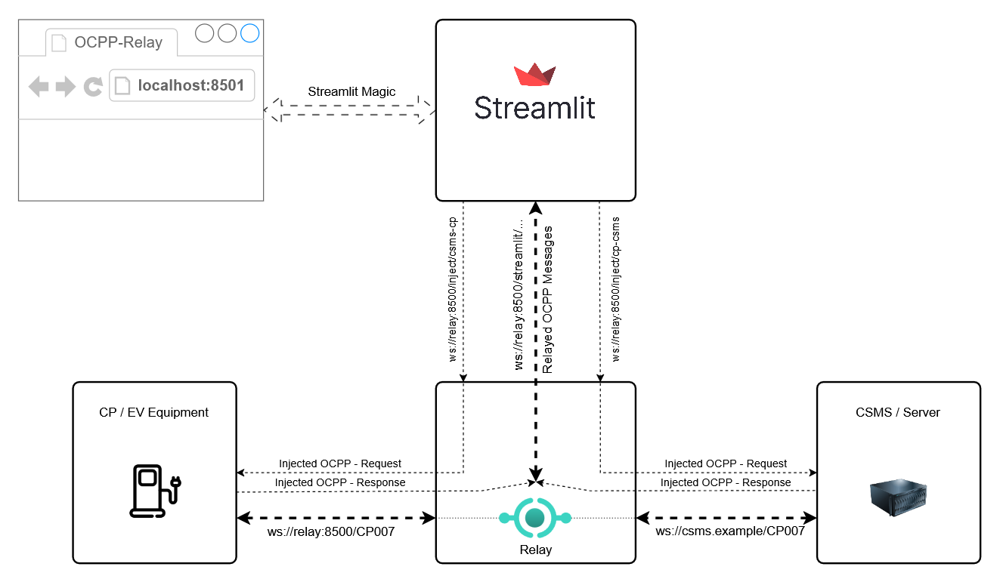
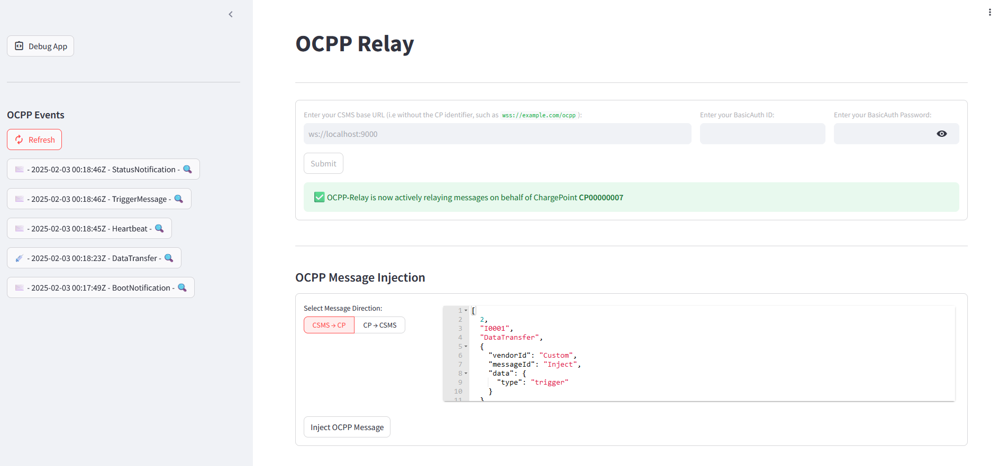
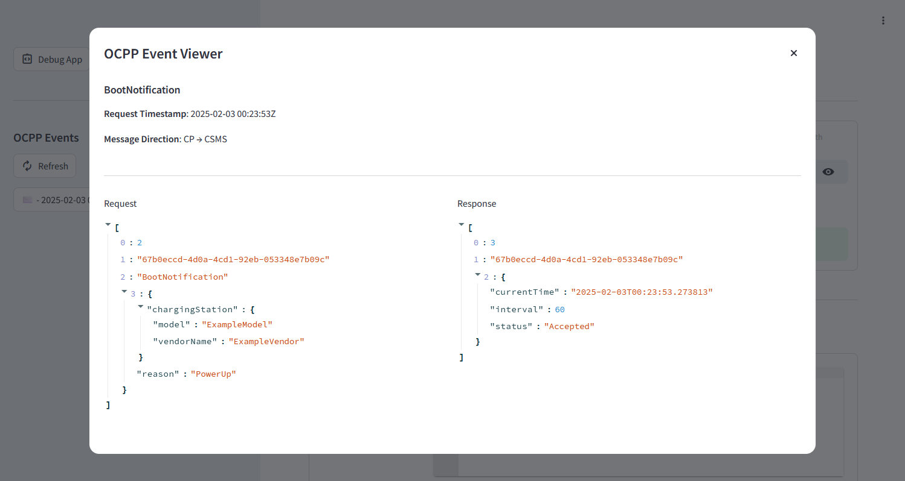

## OCPP Relay

A web-based tool designed to act as a relay or proxy between a charge point (CP) and a central system (CSMS)
implementing the Open Charge Point Protocol (OCPP). The tool provides a simple user-interface for displaying 
OCPP JSON messages relayed between the two parties. It also provides additional functionality to inject new OCPP Call 
messages (requests) in either direction, and it's response is not relayed back to the other party.

### Potential Use Cases:

* Debugging communication issues between charge point and central system
* Inspecting OCPP messages & flow between charge point and central system
* Injecting OCPP Requests for testing new functionalities

### Getting Started

 1. Ensure the target CSMS is running and accepting connections prior
 2. Start the relay and the streamlit web app (two options documented below)
 3. Configure the target CSMS URL and BasicAuth (if applicable) in the streamlit webapp
 4. Finally, configure CP to point to the relay's websocket endpoint

**Option 1: Docker**

~~~shell
➜ docker-compose up --build
~~~

**Option 2: Python (Suitable if connecting to CSMS server running on a specific host and port that is not accessible to docker)**
~~~shell
➜ poetry install # to install all dependencies of the project
# In Terminal 1:
➜ poetry run relay.py
# In Terminal 2:
➜ poetry run streamlit run main.py --logger.level=info
~~~

### Architecture:

### Demo / Main UI:

### Demo / OCPP Event Viewer:

